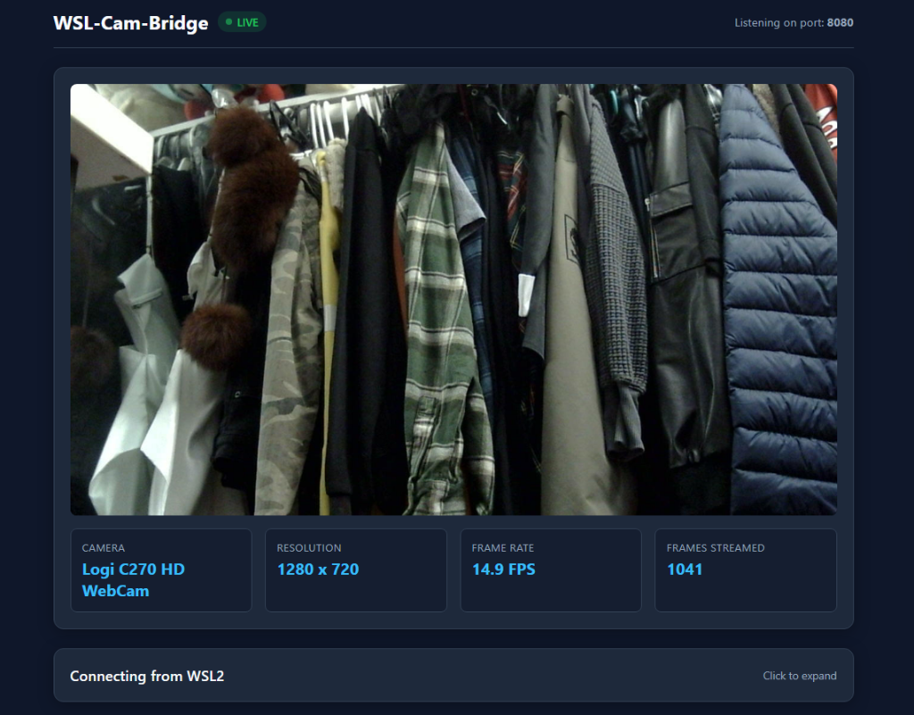
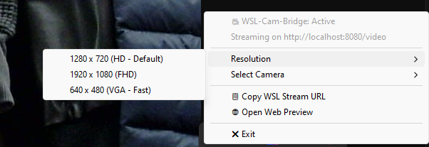

# WSL-Cam-Bridge

A Windows system tray application that streams webcam video into WSL2.



## Why it exists

Using `usbipd-win` to forward webcams into WSL2 does not work for integrated laptop cameras (such as on Dell XPS, ThinkPad, and Surface devices) because they connect over internal PCIe or MIPI buses rather than USB. In addition, default WSL2 kernels do not include UVC webcam drivers.

This tool captures video on the Windows host using Windows Media Foundation and streams it as MJPEG over local HTTP (`localhost:8080`).

## How to run

### 1. Windows

Download `wsl-cam-bridge.exe` from [Releases](https://github.com/Rowrow620/wsl-cam-bridge/releases) and run it.

The app runs in the system tray near the clock. You can right-click the tray icon to switch cameras, change resolution, or copy the stream URL. You can also view the stream in your browser at `http://localhost:8080`.




### 2. WSL2

#### Option A: Direct stream (OpenCV)

Read the stream directly by URL without creating a virtual device:

```python
import cv2

cap = cv2.VideoCapture("http://localhost:8080/video")

while True:
    ret, frame = cap.read()
    if not ret:
        continue
    cv2.imshow("WSL2 Webcam", frame)
    if cv2.waitKey(1) & 0xFF == ord('q'):
        break

cap.release()
cv2.destroyAllWindows()
```

#### Option B: Virtual `/dev/video0`

If your application requires a Linux video device:

```bash
chmod +x wsl/setup_v4l2.sh
./wsl/setup_v4l2.sh
```

This loads `v4l2loopback` and pipes the HTTP stream into `/dev/video0`.

## Endpoints

- `http://localhost:8080` (browser dashboard and preview)
- `http://localhost:8080/video` (direct MJPEG video stream)

## Run on startup

To launch the bridge automatically when Windows boots:

Right-click the system tray icon and select "Launch on Startup". You can click it again anytime to disable it.

## License

GPL-3.0. See [LICENSE](LICENSE) for details.


